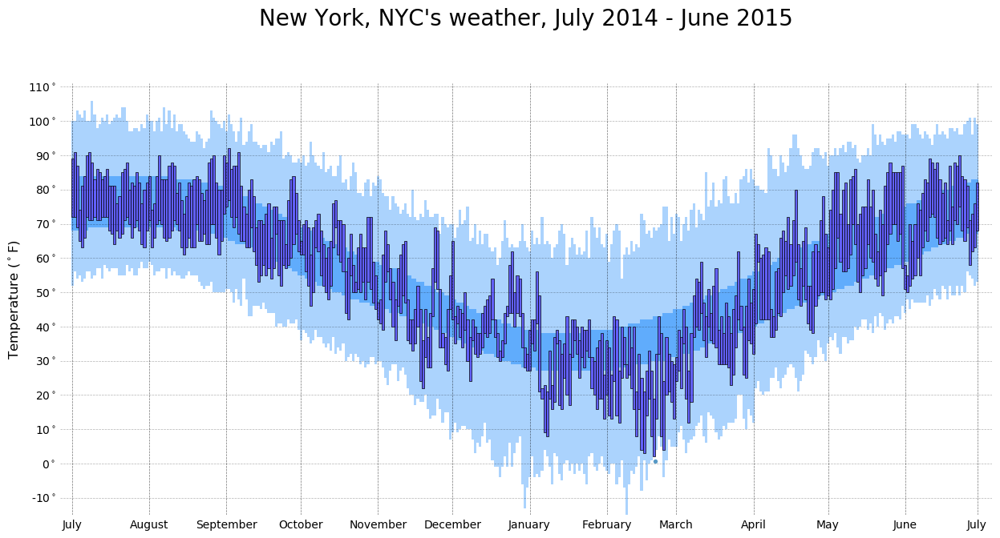
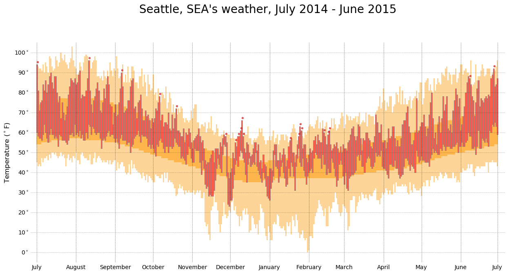

# SPR2019-ADV Final Project

## Comparison of weather in SEATTLE and NEW YORK

### Mingrui Yin

---

<!-- .slide: data-background-image="map.png" -->

---

## Data: U.S. Weather History

|       Column       |                    Description                       |
|:------------------:|:----------------------------------------------------:|
|date                |The date of the weather record, formatted YYYY-M-D    |
|actual_min_temp     |The measured minimum temperature for that day         |
|average_min_temp    |The average minimum temperature on that day since 1880|
|record_min_temp     |The lowest ever temperature on that day since 1880    |
|record_min_temp_year|The year that the lowest ever temperature occurred    |
|actual_precipitation|The measured amount of rain or snow for that day      |

---------------

|   date   |  KCLT_temp | KCLT_precipitation |  KCQT_temp | KCQT_precipitation |
|:---------|:----------:|:------------------:|:-----------|:------------------:|
| 2014-7-1 |     81     |          0         |      70    |          0         |
| 2014-7-2 |     85     |          0         |      70    |          0         |
| 2014-7-3 |     82     |        0.14        |      72    |          0         |

> https://github.com/fivethirtyeight/data/tree/master/us-weather-history

---

## Vega-lite Framework

---

## Matplotlib in Python

The shallowest range means record highs and lows from 1880.

Median means average temp, the deepest means the actual range in 2014-2015.

---

The red bullet means new record high temp.

The weather in Seattle is hotter than in previous years.

---

## Plotly Framework

[Plotly](Plotly.html)

**Rainfall** is more average in New York, is mainly concentrated in winter in Seattle.

Despite the similar **Temperature** in summer, in New York, winter is significantly colder than Seattle's.

---

# Thank you!

