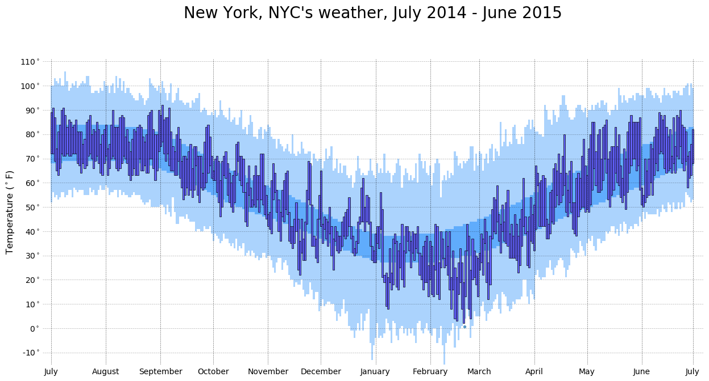
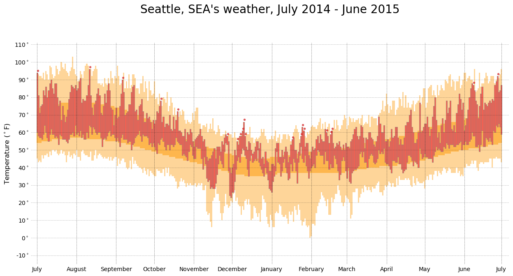

## SPR2019-ADV Final Project

## Mingrui Yin

---

Data: U.S. Weather History Data 

|   date   |  KCLT_temp | KCLT_precipitation |
|----------|:----------:|-------------------:|
| 2014-7-1 |     81     |          0         |
| 2014-7-2 |     85     |          0         |
| 2014-7-3 |     82     |        0.14        |

> https://github.com/fivethirtyeight/data/tree/master/us-weather-history

---

Vega-lite Framework

---

Matplotlib in Python

---

---

Plotly Framework
[Plotly](Plot 37.html)

---

<!-- .slide: data-background-color="#999999" -->

hi there

**This is the presentation!**

Hello.  This is a fragment.

